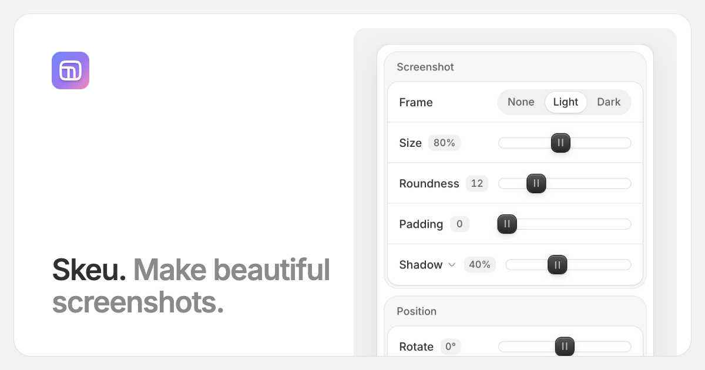

<br>

[](https://skeu.app)
[](LICENSE)

**Skeu** makes beautiful screenshots. Drop one in, give it a window frame, a shadow and a background, and download it. Try it at **[skeu.app](https://skeu.app)**.

Everything happens in the browser: your images are never uploaded.

[](https://skeu.app)

## Run it

```bash
npm install
npm run dev
```

Then open [localhost:3000](http://localhost:3000). It's a Next.js app with no backend and nothing to configure.

## What it does

Drop an image on the page, paste one with `⌘V`, or choose one. It lands on a canvas you can resize from the corner, or set to a fixed ratio.

**Screenshot.** A light or dark window frame, size, roundness, padding and a shadow. The shadow's offset, blur, spread and color sit behind the arrow next to its name.

**Position.** Rotate it, tilt it in 3D with the pad, or snap it to an edge with the grid. Drag the screenshot itself to place it anywhere; it snaps to the center when you get close. On a phone, pinch to scale.

**Background.** A gradient or a solid color, from the presets or your own.

**Crop.** Trim the source image without leaving the editor. Crop edges snap to straight lines in the image, so a browser's address bar comes off cleanly. Hold `⇧`, `⌃`, `⌥` or `⌘` to drag freely.

Each section has a Reset, and everything can be undone. Your style is remembered between visits; the image isn't.

## Getting it out

PNG, JPG or WebP at 1×, 2× or 3×, or straight to the clipboard. The export is the canvas at full resolution, not a capture of what's on screen.

## Keyboard

| Shortcut | |
|----------|--|
| `⌘V` | Paste an image |
| `⌘O` | Choose an image |
| `⌘S` | Download |
| `⌘C` | Copy to the clipboard |
| `⌘Z` / `⇧⌘Z` | Undo / redo |
| Arrow keys | Resize the canvas from the corner handle. `⇧` for bigger steps |
| `Enter` / `Esc` | Apply or cancel a crop |

## License

© 2026 David Krasniy

Licensed under [MIT](LICENSE)
